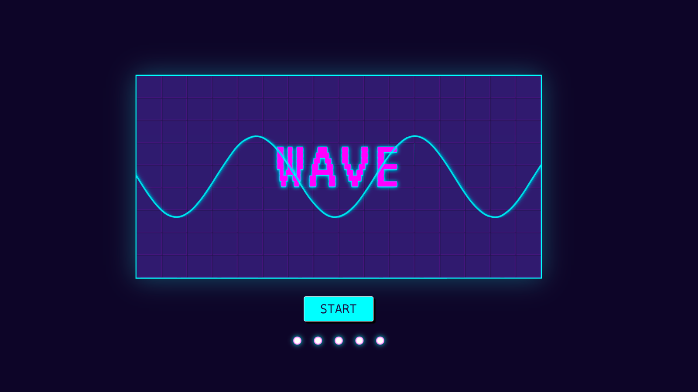
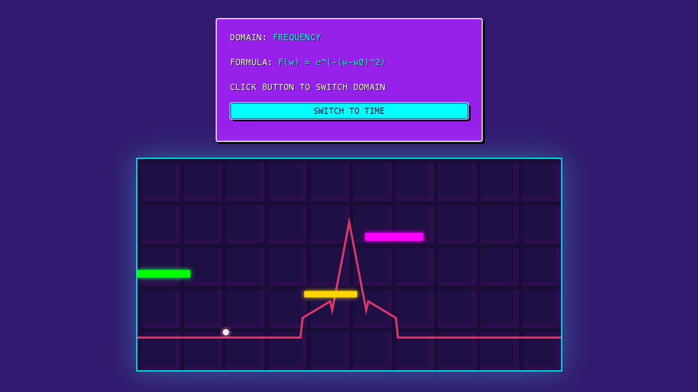

# Wave
**An interactive mini-game inspired by mathematical functions and signal waves**

### Gameplay
- Transforming abstract concepts such as sine waves, harmonic superposition, and Fourier analysis into playable mechanics.
- [➡️ robinnnnnns.github.io/wave/](robinnnnnns.github.io/wave/)

### Team Members
- Robin: Programming, Level Design, UI Design
- Suetex: Inspiration and Level Design

